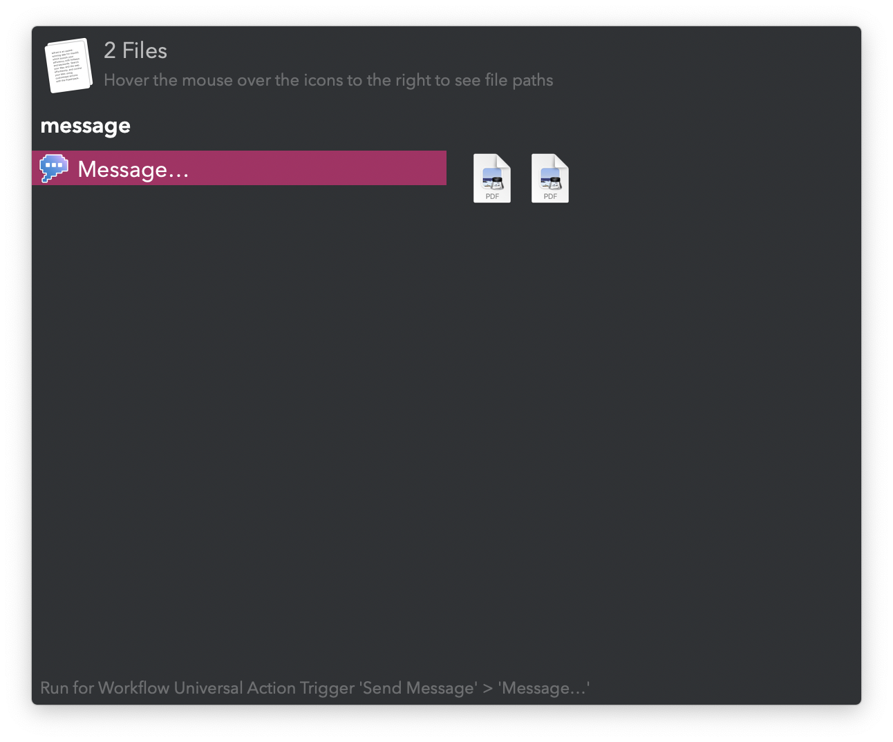
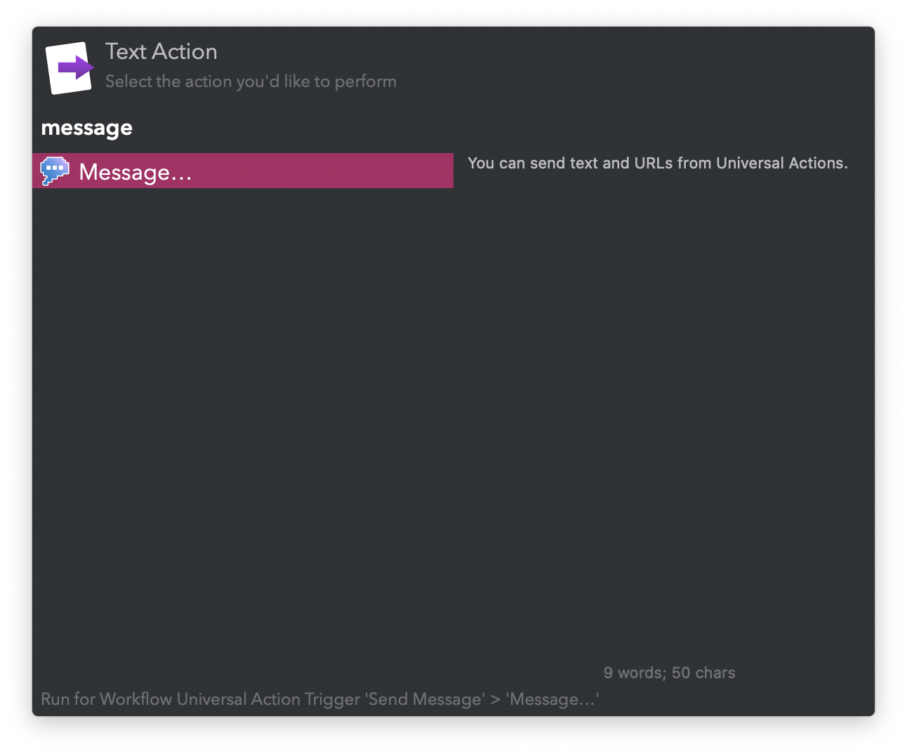

#  Send Message Alfred Workflow

Message a contact

[⤓ Install on the Alfred Gallery](https://alfred.app/workflows/vitor/send-message)

## Usage

Write and send a message to an ongoing conversation in Messages via the `message` keyword.

Send URLs, files, and text from a selection or [Clipboard History](https://www.alfredapp.com/help/features/clipboard/) with the [Universal Actions](https://www.alfredapp.com/help/features/universal-actions/).

